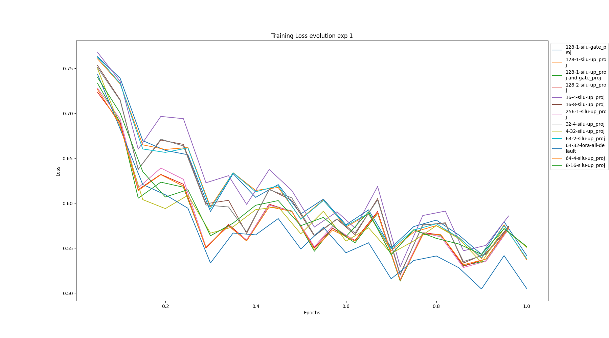
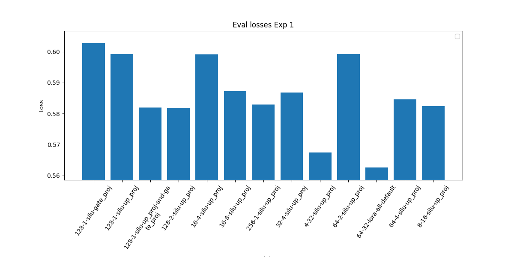
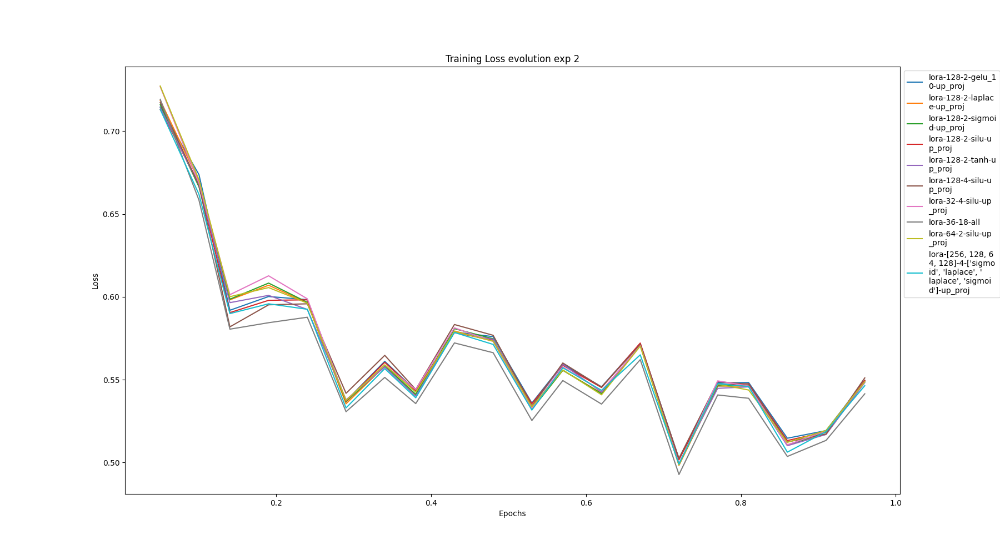
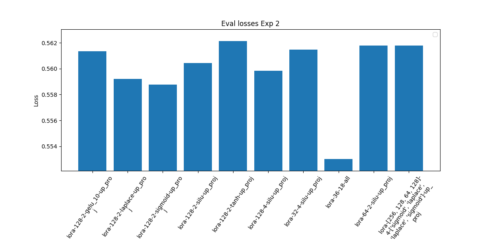
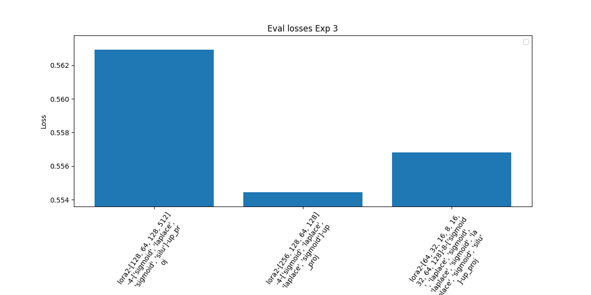
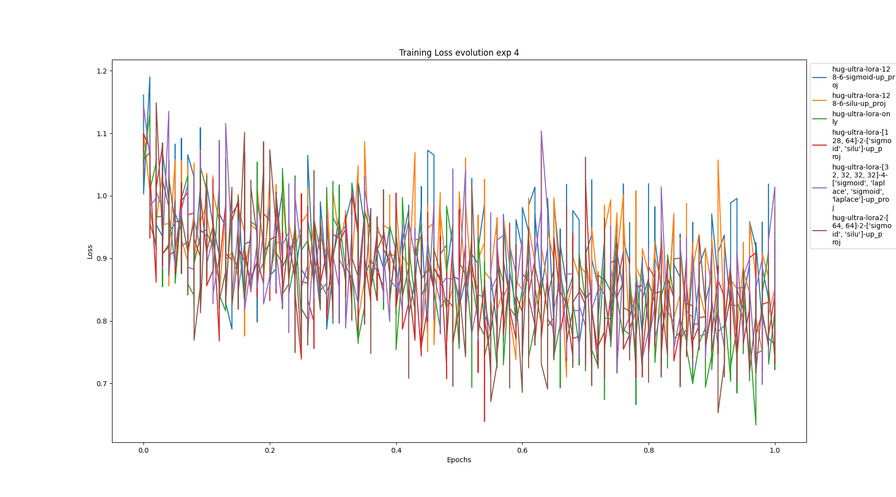
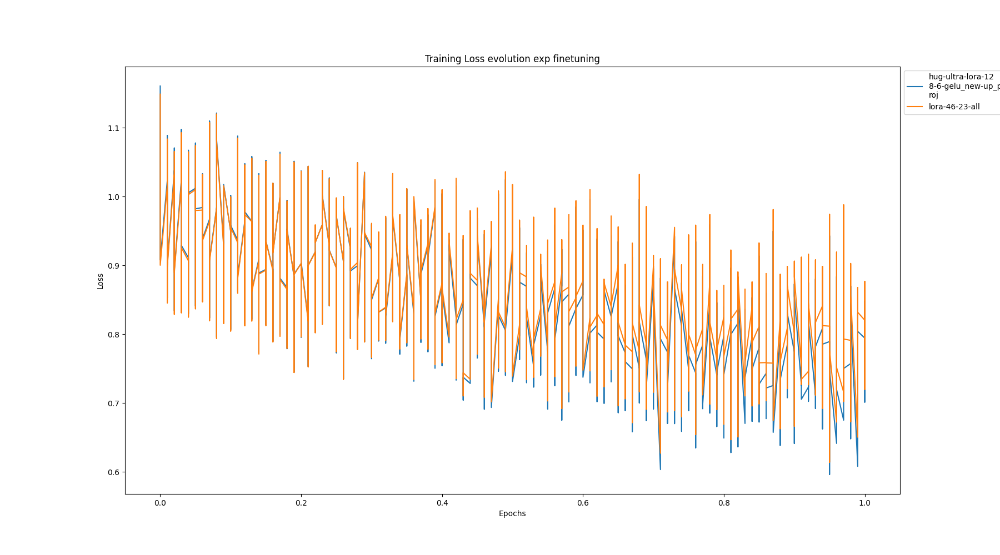
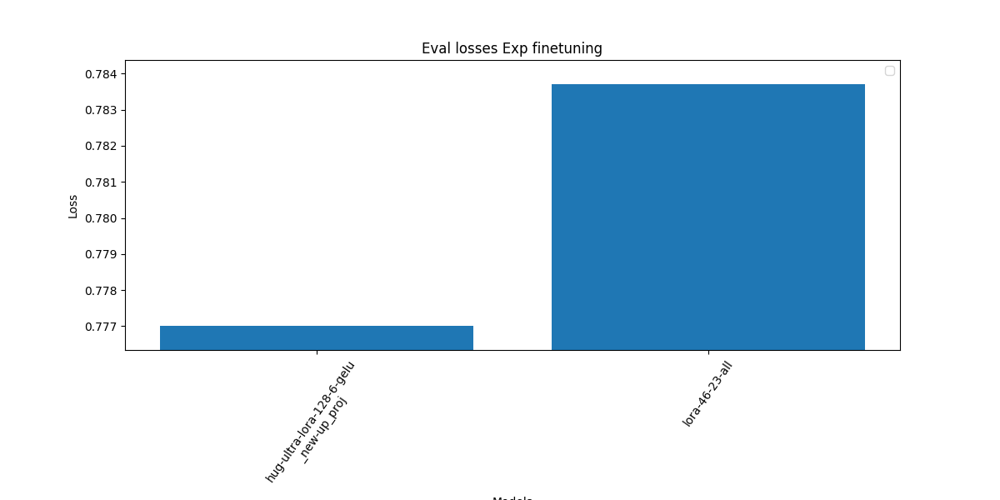

# Research README

## Introduction
This research is part of a larger project and focuses on the development and finetuning mistral 7B. The goal is to innovate a new way to train a model with low hardware.

## Requirements
To reproduce the research, you will need Python and pip installed on your machine. Your machin should have GPU and cuda installed on. The specific libraries and tools used in this research are:

You will need to install the libraries that are in the requirements.txt file (root of the project). You can do this by running the following command in your terminal:

It's highly recommended to use a virtual environment to avoid conflicts with other projects.
This research use patch to fix some bugs in the libraries. (The patch is automatic)

```bash
pip install -r requirements.txt
```

and install manually the following libraries:

choose the right cuda and torch version for [unsloth](https://github.com/unslothai/unsloth/) (see the repo for more information)


```bash
pip install torch==2.2.0 triton --upgrade --index-url https://download.pytorch.org/whl/cu121 --force-reinstall
pip install "unsloth[cu121_ampere_torch220] @ git+https://github.com/unslothai/unsloth.git@12b19e31f9f2bd548401d9411ebb4ad840c54acc"
```


## Goal

LORA is a well established method for finetunig a model with low hardware. The goal of this research is to innovate a new way to train a model with low hardware.
With the release of the Mixtral model, the Feed Forward network seems to be a very import part of the model.

That's why we are going to focus on the development and finetuning mistral 7B.

### FFF

The Fully Feed Forward (FFF) network is an adapter that is injected before the MLP layer of the model.
This adapter is a series of MLP layers that are trained to adapt the model to a specific task.

The FFF network can be injected on the top of up_proj or gate_proj of the MLP layers.

### Hyperparameters

The hyperparameters used in this research are:

- number of MLP layers in the FFF network
- number of neurons in each layer (intermediate size)
- activation function
- injection point (up_proj or gate_proj)
- specific layers where FFF network are injected

## Methodology

The research is divided into 2 main steps:

1. Find the best hyperparameters for the FFF network:
   1. Find the best hyperparameters for the FFF network with a small training set and the same activation function for all the layers
   2. Adding a small lora adapter with the fff adapter during the training and repeat the first step with more possibilities such as different activation functions for each layer inside the fff adapter.

      The fff adapter's hyperparameters are chosen from the best hyperparameters found in the previous step.
    
   3. Increase the lora adapter for the best fff adapter found in the previous step
   4. Repeat the previous steps with bigger datasets

All the experiments are done with a small training set to speed up the process.
The learning rate is set to 3e-5 and the batch size is set from 1 to 10.
The transformer seed is set to 12. 
For all the experiments, we train a lora adapter with the same number of trainable parameters as the fff adapter, that make the comparison fair.

The purpose is to have the most deterministic results possible.


## Results

### Step 1

After a lot of experiments with a small training set, we compare the result of the training with LORA.

We use the validation loss to compare the results. All the experiments are done with the same training set and the same validation set, and the validation set is not on the training set.

We add others datasets during the experiments, but we compare what is only comparable.

For the i, ii, we use the same training set and the same validation set:

- [Magicoder-OSS-Instruct-75K](https://huggingface.co/datasets/ise-uiuc/Magicoder-OSS-Instruct-75K)
- [MetaMathQA](https://huggingface.co/datasets/meta-math/MetaMathQA)

For the iii, iv, we use the same training set and the same validation set:

- [Magicoder-OSS-Instruct-75K](https://huggingface.co/datasets/ise-uiuc/Magicoder-OSS-Instruct-75K) 
- [MetaMathQA](https://huggingface.co/datasets/meta-math/MetaMathQA)
- [HuggingFaceH4/ultrachat_200k](https://huggingface.co/datasets/HuggingFaceH4/ultrachat_200k)
- [freecs/ArtificialThinkerSet](https://huggingface.co/datasets/freecs/ArtificialThinkerSet)  (because the dataset is small, the training set is the validation set too)

We take a part of the dataset to speed up the process.

#### Plots

For all the plots the graph legend follows the following pattern:

if the beginning of the legend start with:
- `lora` has a little lora adapter (r=16 , alpha=8 , target_modules="q_proj", "k_proj", "v_proj", "o_proj", "gate_proj", "up_proj", "down_proj",)
- `lora2` has a bigger lora adapter (r=32 , alpha=16 , target_modules="q_proj", "k_proj", "v_proj", "o_proj", "gate_proj", "up_proj", "down_proj",)

And then the rest of the legend follows this rules:

- {[number of neurons in each layer]} - {number of layers} - {[activation function]} - {[injection point]}

If activation function is not present or the legend contains all, that means this is the lora adapter for reference to compare with the fff adapter.

Specific cases:

when there is 128-6 on the legend just some layer of the model (from 10 to 20 for example) has the fff adapter

##### i. First experiments 





The conclusion for this part is that LORA is better than FFF.

The training loss curve is almost always better (lower) for LORA than for FFF.
And the validation loss is better (lower) for LORA than for FFF. 

##### ii. Different activation functions





It's very hard t conclude with this part. The results are not very clear.
All the different adapters have a very close loss curve and validation loss.

##### iii. Increase the lora adapter




Same as before,

It's very hard t conclude with this part. The results are not very clear.
All the different adapters have a very close loss curve and validation loss.

##### iv. Bigger datasets




Here it seems like the lora adapter is better than the fff adapter. But the datasets was shuffled without the same seed, so it's not so deterministic.


#### Conclusion

The best hyperparameters for the FFF network are:


### Step 2

We finetune the model with the best hyperparameters found in the previous step.

The Lora adapter contains 120M parameters and the FFF adapter contains 129M parameters.

In this part, the FFF adapter is combined with a Lora adapter (r=24, a=12)

The training set is: 

- [Magicoder-OSS-Instruct-75K](https://huggingface.co/datasets/ise-uiuc/Magicoder-OSS-Instruct-75K)
- [MetaMathQA](https://huggingface.co/datasets/meta-math/MetaMathQA)
- [HuggingFaceH4/ultrachat_200k](https://huggingface.co/datasets/HuggingFaceH4/ultrachat_200k)
- [freecs/ArtificialThinkerSet](https://huggingface.co/datasets/freecs/ArtificialThinkerSet) x6 (because the dataset is small, the training set is the validation set too)

The validation set has been split from the training set if needed. Again here we take a part (bigger than for the experiments) of the dataset to speed up the process.

#### Plots

The following plot shows the training and the validation loss of the finetuning:






#### Table

The following table shows the validation loss of the finetuning for the different datasets take one by one:


| Dataset                      | lora  | fff   |
|------------------------------|-------|-------|
| Magicoder-OSS-Instruct-75K   | 0.457 | 0.460 |
| MetaMathQA                   | 0.471 | 0.476 |
| HuggingFaceH4/ultrachat_200k | 1.023 | 1.049 |
| freecs/ArtificialThinkerSet  | 0.194 | 0.143 |

#### Conclusion

Both of the adapters have very close validation losses.

We can say that the FFF adapter is as good as the Lora adapter.


## Reproducing the research
 To reproduce the research you can play the hyperparameters in the `train.py` file (line 140)

 To reproduce the results, play with the file `result.py` by changing the location of the output of the training in the `result.py` file (line 18 and 110)


## Contributing

If you want to contribute to this research, you can fork the repository and create a pull request with your changes.
I will be happy to review your pull request and merge it if it is relevant.


## Licence

Under GNU General Public License v3.0


## Credits

Big thanks to unsloth and their optimized library that make this research possible.

